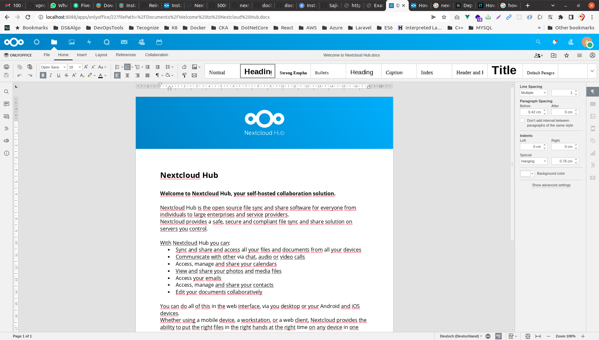

## Nextcloud with Postgres database
This example defines one of the base setups for Nextcloud.

Project structure:
```
.
├── docker-compose.yaml
└── README.md
```

[_docker-compose.yaml_](docker-compose.yaml)
```
services:
  app:
    image: nextcloud:apache
    ports:
      - 80:80
    ...
  db:
    image: postgres:alpine
    ...
  redis:
    image: redis:alpine
    ...
```

When deploying this setup, docker-compose maps the nextcloud container port 8088 to
port 80 of the host as specified in the compose file.

## Deploy with docker-compose

```
$ docker$ compose up -d
```


## Expected result

Check containers are running and the port mapping:
```
$ docker ps
CONTAINER ID        IMAGE               COMMAND                  CREATED             STATUS              PORTS                NAMES
9884a9cc0144        postgres:alpine     "docker-entrypoint.s…"   12 minutes ago      Up 12 minutes       5432/tcp             nextcloud-postgres_db_1
bae385bee48b        nextcloud:apache    "/entrypoint.sh apac…"   12 minutes ago      Up 12 minutes       0.0.0.0:8088->80/tcp   nextcloud-postgres_nc_1
bae385bee48b        redis:apache       "/entrypoint.sh apac…"   12 minutes ago      Up 12 minutes       0.0.0.0:8088->80/tcp   nextcloud-docker_redis_1
```

Navigate to `http://localhost:8088` in your web browser to access the installed
Nextcloud service.


Click “Install” to complete the installation process.


Click “Install recommended apps” to complete the installation process. It might take a few moments while apps are installed. Don’t close your browser tab until setup completes. Once Nextcloud’s ready, you’ll be shown a quick set of getting started slides. You’ll then be taken to the Nextcloud dashboard.
Stop and remove the containers


Nextcloud dashboard


To install extra apps, click your user profile icon in the top-right corner. Choose “Apps” from the menu. Click one of the categories in the left sidebar to see all of the available apps. Press “Download and enable” below any app’s card to add it to your Nextcloud instance.

### Getting a fully working ONLYOFFICE in Nextcloud now just requires two steps:

1. Install the Community Document Server App. Use the search keywords ‘document’ or ‘community’ in the app installation screen in Nextcloud. For installation from the command line, use: occ app:install documentserver_community (Please note: installation will take a while as the app is big).


2. Next, install the OnlyOffice App Use the search keywords ‘onlyoffice’ in the app installation screen in Nextcloud. For installation from the command line, use: occ app:install onlyoffice (There is no need to configure anything!).


3. Get to work!

```
$ docker-compose down
